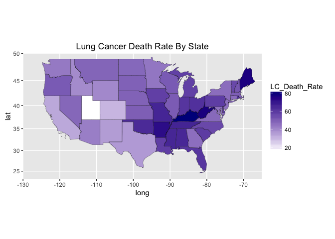

MATH 216 Data Science Final Project (Fall 2016)
================

-   Name: Katherine Hobbs
-   Project title: Smoking Prevalence, Regulation, and Outcomes Across the United States
-   Write-up on RPubs: <http://rpubs.com/khobbs/Hobbs_Abstract>
-   Abstract:

The anti-tobacco campaign in the mid to late 20th century is widely considered one of the most successful public health campaigns in American history. Even so, according to the CDC, smoking remains the number one cause of preventable death and disease in the United States, causing roughly 480,000 deaths per year. This exploration of 2013 smoking and demographic data investigates the relationships between smoking prevelance, regulation, and outcomes in the United States. Results show that lung cancer death rates correlate positively with the percentage of smokers in a state and with cigarette consumption, while they correlate negatively with median household income. Additionally, while there is a very weak negative correlation between tobacco tax and lung cancer death rate, there is a much stronger negative correlation between tobacco tax and percentage of smokers, suggesting, but certaintly not proving, that tobacco taxes contribute to lower lung cancer death rates by detering people from smoking. 

